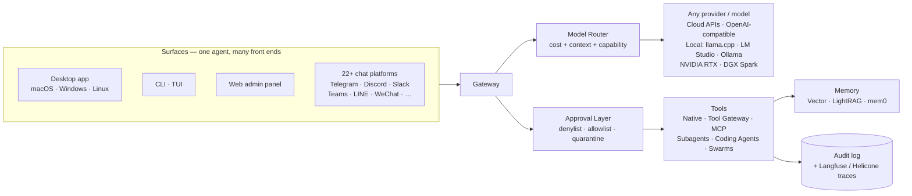

# Hermes Optimization Guide

<p align="center">
  
</p>

[](./LICENSE)
[](https://github.com/NousResearch/hermes-agent/releases/tag/v2026.7.1)
[](./CHANGELOG.md)
[](#table-of-contents)
[](./skills/)
[](./templates/config/)
[](./.github/workflows/ci.yml)
[](./CONTRIBUTING.md)

> **Current through Hermes Agent v0.18.0 (v2026.7.1) — "The Judgment Release"** · **27 parts, 13 installable guide skills, 5 opinionated configs, 4 reference architectures, one-command VPS bootstrap** · Now covering **Mixture-of-Agents as a first-class model**, evidence-based **verification** + `/goal` completion contracts, **`/learn` + `/journey`** self-improvement, **background subagent fan-out**, the maturing **Desktop app** (Projects, memory graph, multi-terminal), **iMessage via Photon** (no Mac needed), the NVIDIA RTX / DGX Spark local-hardware story, and gateway **scale-to-zero** for teams. **Bring any model** — this guide is about the *harness*, not the weights.
>
> Other languages: [中文](./README-zh.md) · [日本語](./README-ja.md)

### The End-to-End Hermes Guide — docs + runnable artifacts
Every part you need to go from fresh install to a production Hermes deployment — driven from the **native desktop app**, the CLI/TUI, a browser admin panel, or 25+ chat platforms (now including iMessage with no Mac required, via Photon). Orchestrate Claude Code / Codex / Gemini CLI through durable Kanban lanes and **multi-agent swarms**, plug into any MCP server, trace every call in Langfuse, let it curate its own skills, push heavy work onto disposable Modal/Daytona/Vercel sandboxes — or run the whole thing **locally on your own GPU / NVIDIA DGX Spark**. It's all **model-agnostic**: bring whatever weights you want, the guide is about the *harness*.

Unlike most guides, the prescriptions come with **working files**: [`skills/`](./skills) you can `ln -s` into `~/.hermes/skills/`, [`templates/config/`](./templates/config) you `cp` to `~/.hermes/config.yaml`, [`scripts/vps-bootstrap.sh`](./scripts/vps-bootstrap.sh) that takes a fresh VPS to production in one command.

*By Terp — [Terp AI Labs](https://x.com/OnlyTerp)* · Last updated **July 1, 2026** · [CHANGELOG](./CHANGELOG.md) · [ROADMAP](./ROADMAP.md) · [ECOSYSTEM](./ECOSYSTEM.md)

---

## Install

Pick the surface that fits you — they all drive the **same** agent, config, keys, sessions, and skills.

**Easiest — the desktop app.** Grab the [Hermes Desktop](https://hermes-agent.nousresearch.com/docs/user-guide/desktop) installer for macOS/Windows/Linux (or run `hermes desktop` if you already have the CLI). First launch offers **Quick Setup via Nous Portal** — sign in, pick a model, start chatting. Full tour: **[Part 24: Hermes Desktop App](./part24-desktop-app.md)**.

**Terminal — one line.** macOS / Linux:

```bash
curl -fsSL https://hermes-agent.nousresearch.com/install.sh | bash
```

Windows (native, PowerShell):

```powershell
iex (irm https://hermes-agent.nousresearch.com/install.ps1)
```

**Server — one command to production.** On a fresh Debian 12 / Ubuntu 24.04 box (Hetzner CX22 works great for ~$5/mo):

```bash
curl -sSL https://raw.githubusercontent.com/OnlyTerp/hermes-optimization-guide/main/scripts/vps-bootstrap.sh | sudo bash
```

This installs Hermes, Node.js, Caddy (auto-TLS reverse proxy), UFW, fail2ban, creates a non-root `hermes` user, drops in hardened systemd units, and symlinks every skill from this repo into `~hermes/.hermes/skills/`. See [`scripts/vps-bootstrap.sh`](./scripts/vps-bootstrap.sh) for what it does line by line — it's non-destructive and re-runnable.

Prefer a 5-minute local-only setup? → **[docs/quickstart.md](./docs/quickstart.md)** (zero to Telegram bot in 5 min).

---

## Repo Map

| Folder | What's in it |
|---|---|
| [`skills/`](./skills) | **13 installable `SKILL.md`** files. `ln -s` into `~/.hermes/skills/` and they're live. |
| [`templates/config/`](./templates/config) | **5 opinionated `config.yaml`** — minimum, telegram-bot, production, cost-optimized, security-hardened. |
| [`templates/compose/`](./templates/compose) | Self-hosted Langfuse v3 stack (ClickHouse + MinIO + Redis). |
| [`templates/caddy/`](./templates/caddy) | Caddyfile reference (reverse proxy + auto TLS + HSTS). |
| [`templates/systemd/`](./templates/systemd) | Hardened `hermes.service` + `hermes-dashboard.service`. |
| [`templates/cron/`](./templates/cron) | Recommended production cron schedule. |
| [`scripts/vps-bootstrap.sh`](./scripts/vps-bootstrap.sh) | One-command fresh VPS → production Hermes. |
| [`diagrams/`](./diagrams) | 6 Mermaid diagrams (architecture, MCP flow, delegation, sandbox sync, observability, security layers). |
| [`assets/`](./assets) | Banner graphics used across the guide. |
| [`benchmarks/`](./benchmarks) | Reproducible cost + latency table across 12 models × 5 tasks. |
| [`docs/wizard/`](./docs/wizard) | **Interactive config wizard** — 8 questions → ready-to-drop `config.yaml`. Runs in your browser. |
| [`docs/reference-architectures/`](./docs/reference-architectures) | **4 blueprints** — Homelab, Solo Dev, Small Agency, Road Warrior. Full parts list + cost + install. |
| [`docs/outreach/`](./docs/outreach) | Launch tweet, HN post, upstream-PR body drafts (for people linking to this guide). |
| [`docs/quickstart.md`](./docs/quickstart.md) | 5-minute zero-to-Telegram-bot. |
| [`ECOSYSTEM.md`](./ECOSYSTEM.md) | Curated directory of MCP servers, coding agents, dashboard plugins. |
| [`ROADMAP.md`](./ROADMAP.md) · [`CHANGELOG.md`](./CHANGELOG.md) · [`CONTRIBUTING.md`](./CONTRIBUTING.md) | The usual suspects. |
| README + `part1-*.md` … `part26-*.md` | The 27-part guide itself (now incl. MoA + verification, Desktop App, NVIDIA / local hardware). |

---

## Architecture at a glance



Full set of diagrams: [`diagrams/architecture.md`](./diagrams/architecture.md).

---

## Pick Your Path

This guide grew to 27 parts because *Hermes grew*. Six sections (Parts 1–5 plus SOUL.md) live in this README; Parts 6–26 live as separate files. You don't have to read them all — pick the shortest path to what you need:

### 🎯 "I just want it working in 10 minutes"
Skip the terminal: install the [desktop app](./part24-desktop-app.md) and let first-run **Quick Setup via Nous Portal** pick a model for you. Prefer the CLI? [Part 1: Setup](#part-1-setup-stop-fumbling-with-installation) → [Part 12: Web Dashboard](./part12-web-dashboard.md) and point-and-click the rest.

### 📱 "I want a Telegram bot that's actually useful"
[Part 1](#part-1-setup-stop-fumbling-with-installation) → [Part 4: Telegram](./part4-telegram-setup.md) → [Part 5: On-the-fly Skills](./part5-creating-skills.md) → [Part 7: Memory](./part7-memory-system.md).

### 🤖 "I want to drive Claude Code / Codex / Gemini from my phone"
[Part 18: Coding Agents](./part18-coding-agents.md) → [Part 23: Foundation + Tenacity Stack](./part23-tenacity-stack.md) → [Part 21: Remote Sandboxes](./part21-remote-sandboxes.md).

### 💼 "I'm running this in production"
[Part 19: Security Playbook](./part19-security-playbook.md) → [Part 20: Observability & Cost](./part20-observability.md) → [Part 16: Backup & Debug](./part16-backup-debug.md) → [Part 23: Kanban + Goals + Handoff](./part23-tenacity-stack.md).

### 🧠 "I want the most capable agent possible, cost be damned"
[Part 17: MCP Servers](./part17-mcp-servers.md) → [Part 18: Coding Agents](./part18-coding-agents.md) → [Part 3: LightRAG](./part3-lightrag-setup.md) → [Part 14: Fast Mode](./part14-fast-mode-watchers.md) → [Part 20: Observability](./part20-observability.md).

### 💰 "I want the cheapest possible agent that still works"
[Part 9: Custom Models](./part9-custom-models.md) (Grok/Gemini/Kimi/GLM routing) → [Part 20: Observability](./part20-observability.md#cost-routing-playbook-the-one-that-actually-saves-money) → [Part 6: Context Compression](./part6-context-compression.md).

### 🛡️ "I'm worried about prompt injection (you should be)"
[Part 19: Security Playbook](./part19-security-playbook.md) — read this first if your agent reads any untrusted input (email, webhooks, Discord, public Telegram groups).

### 🖥️ "Just give me an app, not a terminal"
[Part 24: Hermes Desktop App](./part24-desktop-app.md) — download, Quick Setup, and drive everything from a real GUI: streaming chat, a Cmd+K command palette, drag-and-drop files, a model picker, and an optional connection to a remote Hermes box.

### 🔒 "Run it all locally on my own GPU"
[Part 25: NVIDIA & Local Hardware](./part25-nvidia-local.md) — RTX / DGX Spark, OpenShell isolation, and a model-agnostic local stack (llama.cpp / LM Studio / Ollama) so your data never leaves the machine.

### 🧑‍⚖️ "I want an ensemble of frontier models — and proof the work is done"
[Part 26: MoA, Verification & Self-Improvement](./part26-moa-verification.md) — pick a Mixture-of-Agents council like a model, judge `/goal` completion against evidence, and steer what the agent learns with `/learn` + `/journey`.

---

## What's New (July 2026)

Two huge releases landed since the Surface refresh — **v0.17.0 "Reach" (v2026.6.19)** and **[v0.18.0 "The Judgment Release" (v2026.7.1)](https://github.com/NousResearch/hermes-agent/releases/tag/v2026.7.1)**. Combined: ~3,200 commits, ~1,800 merged PRs, 1,200+ issues closed, and — as of v0.18 — **every P0 and P1 issue in the entire Hermes repo resolved** (~700 highest-priority items cleared in twelve days, with a standing commitment to keep the count at zero). None of it is model-specific — bring whatever weights you want.

### v0.18.0 — "Judgment" (latest)

- **Mixture-of-Agents is a first-class model** — every named MoA preset is a selectable virtual model under a `moa` provider in every picker (CLI/TUI/desktop/gateway). Each reference model's reasoning renders as its own labelled block, and the aggregator's answer streams live. `/moa` is now one-shot sugar. See [Part 26](./part26-moa-verification.md).
- **The agent proves its work** — verification evidence for coding tasks (run the project's checks, don't assert success), **completion contracts** for `/goal`, `/goal wait <pid>`, and a `pre_verify` hook. See [Part 26](./part26-moa-verification.md#2-verification--done-means-proven-not-claimed).
- **`/learn` + `/journey`** — distill a reusable skill from anything (`/learn <dir|url|workflow>`), and browse/edit/delete everything the agent has learned on a timeline. The desktop adds a playable **memory graph**. Background self-improvement now routes to an aux model and costs a fraction of before. See [Part 26](./part26-moa-verification.md#3-learn-and-journey--self-improvement-you-can-see) and [Part 7](./part7-memory-system.md).
- **Background subagent fan-out** — `delegate_task` dispatches parallel background subagents and returns one consolidated turn when all finish; your chat is never blocked. See [Part 8](./part8-subagent-patterns.md).
- **Desktop becomes a coding cockpit** — first-class per-profile **Projects** (sidebar, coding rail, review pane, worktree management), a **multi-terminal panel**, PR-style diffs in chat, and a conversation timeline rail. See [Part 24](./part24-desktop-app.md).
- **Run it for a team** — gateway **scale-to-zero** with drain coordination (no dropped in-flight turns), administrator-pinned **managed scope** from `/etc/hermes`, multiplexed profiles over one gateway, and **cron continuations**. See [Part 26](./part26-moa-verification.md#6-running-hermes-for-a-team--scale-to-zero-and-managed-scope).
- **Google Vertex AI provider** — Gemini through your GCP service account with auto-minted, auto-refreshed OAuth2 tokens (no static key). The Gemini-CLI OAuth providers were **removed** — see the migration note in [Part 9](./part9-custom-models.md).
- **Everyday wins** — `/prompt` (compose in `$EDITOR`), `/reasoning full`, `/timestamps`, in-place compaction by default, Blank Slate setup mode, and a security round (MCP-config persistence hardening, cron credential-exfil blocks, Slack `xapp-` token redaction). See [Part 26](./part26-moa-verification.md#5-small-things-youll-use-every-day) and [Part 19](./part19-security-playbook.md).

### v0.17.0 — "Reach"

- **iMessage via Photon Spectrum — no Mac required** — `hermes photon login` and Hermes lives in the blue bubbles; positioned as the successor to the BlueBubbles bridge. Plus an **official WhatsApp Business Cloud API** adapter and the **Raft** agent-network channel. See [Part 15](./part15-new-platforms.md).
- **Background subagents** — `delegate_task(background=true)` returns a handle immediately; the result re-enters the conversation when it finishes. See [Part 8](./part8-subagent-patterns.md).
- **A much deeper desktop app** — rebindable shortcuts, native OS notifications, live subagent **watch-windows**, any VS Code Marketplace theme, a resizable terminal pane, remote media relay, and per-thread drafts. See [Part 24](./part24-desktop-app.md).
- **Dashboard grows up** — a full **profile builder** (model + skills + MCPs from the browser), a rehauled Skills Hub (previews + security scans), and hardened dashboard auth. See [Part 12](./part12-web-dashboard.md).
- **`image_generate` learned to edit** — image-to-image transforms across every provider; **Automation Blueprints** replace raw cron syntax with guided forms; the `memory` tool gained **atomic batch operations**; the Curator's LLM consolidation pass is now **opt-in** (routine curation costs zero tokens). See [Part 22](./part22-latest-power-moves.md) and [Part 7](./part7-memory-system.md).
- **Telegram rich messages** (Bot API 10.1, on by default), MCP **elicitation** (servers can prompt mid-tool-call on any surface), and Cursor's **Composer** model via xAI Grok OAuth. See [Part 15](./part15-new-platforms.md), [Part 17](./part17-mcp-servers.md), and [Part 9](./part9-custom-models.md).

### v0.16.0 — "Surface"

- **Hermes Desktop** — a native macOS/Windows/Linux app: streaming chat with live tool activity, a session list with archive/search, drag-and-drop files, clipboard image paste, a **Cmd+K command palette**, a model picker in the composer, a per-session **YOLO toggle**, and in-app self-update. It's "another surface over one agent, not a fork." See [Part 24](./part24-desktop-app.md).
- **Remote backend** — desktop and clients can connect to a remote Hermes gateway over a secure WebSocket (OAuth or username/password), with per-profile hosts, concurrent multi-profile sessions, and cross-profile `@session` links. Thin GUI local, heavy agent remote. See [Part 24](./part24-desktop-app.md#7-connect-to-a-remote-hermes).
- **Browser admin panel** — the web dashboard grew into a full admin panel: a Channels page that sets up every messaging platform from the browser, MCP catalog enable/disable, credentials, webhooks, memory config, and a System page with **check-before-update** and one-click **Debug Share**. See [Part 12](./part12-web-dashboard.md).
- **Quick Setup via Nous Portal** — `hermes portal` opens a guided first-run that signs you in and picks a model; Quick Setup vs Full Setup paths on first launch. See [Part 1](#part-1-setup-stop-fumbling-with-installation).
- **`/undo [N]`** — take back the last N turns and prefill your last message to edit and resend, with CLI / TUI / messaging parity. See [Part 22](./part22-latest-power-moves.md).
- **Fuzzy model picker + default interface choice** — type-to-filter model search across desktop/web/TUI/CLI, grouped multi-endpoint providers, an hourly-refreshed catalog, and a `cli`-or-`tui` default for `hermes chat` (with a `--cli` per-invocation override). See [Part 22](./part22-latest-power-moves.md).
- **Leaner default skills** — rarely-used bundled skills moved to optional, a new `environments:` relevance gate, and the Curator can now prune built-in skills. See [Part 22](./part22-latest-power-moves.md).
- **NVIDIA Skills Hub tap** — a built-in trusted Skills source alongside OpenAI/Anthropic/HuggingFace (CUDA-X, AIQ, cuOpt), part of the broader NVIDIA local-hardware story. See [Part 25](./part25-nvidia-local.md).
- **Security** — CVE-2026-48710 Starlette pin, SSRF off-loop hardening, and subprocess credential stripping. See [Part 19](./part19-security-playbook.md).

### NVIDIA partnership — run it local

Hermes is now optimized for always-on **local** use on **NVIDIA RTX PCs, RTX PRO workstations, and DGX Spark** (128GB unified memory, ~1 petaflop of AI performance, runs 120B-class MoE models all day). Tensor Cores accelerate inference, there's a dedicated **DGX Spark playbook**, and **OpenShell** adds kernel-level isolation between the agent and your OS. It stays model-agnostic — bring any weights. See [Part 25](./part25-nvidia-local.md).

### Earlier milestones (still relevant)

- **v0.15 "Velocity"** — multi-agent swarms (`hermes kanban swarm`), the big perf wave (~4,500× faster free `session_search`), Brainworm/promptware defense, skill bundles, and ntfy as a messaging platform. See [Part 23](./part23-tenacity-stack.md) and [Part 19](./part19-security-playbook.md).
- **v0.14 "Foundation"** — PyPI installs + lighter launch, Grok OAuth + 1M context, `hermes proxy` (OpenAI-compatible localhost), `x_search`, Teams/LINE/SimpleX, live `/handoff`, and the first native Windows support. See [Part 23](./part23-tenacity-stack.md) and [Part 13](./part13-tool-gateway.md).
- **v0.13 "Tenacity"** — durable multi-agent Kanban, `/goal` persistent objectives, Checkpoints v2, and no-agent cron. See [Part 23](./part23-tenacity-stack.md).
- **v0.12 "Curator"** — the autonomous Curator (`hermes curator`), a rubric-based self-improvement loop, a much wider provider menu, and a plugin-first gateway. See [Part 22](./part22-latest-power-moves.md) and [Part 9](./part9-custom-models.md).
- **v0.11 "Interface"** — the Ink TUI rewrite, a per-transport provider layer, native AWS Bedrock, and auxiliary-model routing for side tasks. See [Part 22](./part22-latest-power-moves.md).

**Fundamentals that haven't changed:** the local web dashboard (`hermes dashboard`), the Tool Gateway + `hermes proxy`, Fast Mode (`/fast`) and guided compression (`/compress <topic>`), and the MCP + coding-agent + remote-sandbox developer stack. See [Part 12](./part12-web-dashboard.md), [Part 13](./part13-tool-gateway.md), [Part 14](./part14-fast-mode-watchers.md), [Part 17](./part17-mcp-servers.md), [Part 18](./part18-coding-agents.md), and [Part 21](./part21-remote-sandboxes.md).

---

## Table of Contents

1. [Setup](#part-1-setup-stop-fumbling-with-installation) — Install Hermes, configure your provider, first-run walkthrough (with Android/Termux)
2. [SOUL.md Personality](#soulmd--give-your-agent-a-personality) — The Molty prompt, what good personality rules look like, how to fix a bland agent
3. [OpenClaw Migration](#part-2-openclaw-migration-dont-leave-your-knowledge-behind) — Move your OpenClaw data, config, skills, and memory into Hermes
4. [LightRAG — Graph RAG](#part-3-lightrag--graph-rag-that-actually-works) — Set up a knowledge graph that actually understands relationships, not just text similarity
5. [Telegram Bot](#part-4-telegram-setup-chat-from-anywhere) — Connect Hermes to Telegram for mobile access, voice memos, and group chats
6. [On-the-Fly Skills](#part-5-on-the-fly-skills-let-hermes-build-its-own-playbook) — Ask Hermes to create new skills that optimize your workflow automatically
7. [Context Compression](./part6-context-compression.md) — Fix the silent context loss bug, configure compression thresholds, survive long sessions
8. [Memory System](./part7-memory-system.md) — The three-tier memory architecture: persistent facts, conversation recall, procedural memory
9. [Subagent Patterns](./part8-subagent-patterns.md) — Orchestrator/worker delegation, ACP subagents, parallel task execution
10. [Custom Model Providers](./part9-custom-models.md) — Grok/SuperGrok OAuth, Bedrock, Azure AI Foundry, Vertex AI, LM Studio, Codex OAuth, MoA presets, OpenRouter routing, model aliases, fallback chains
11. [SOUL.md Anti-Patterns](./part10-soul-antipatterns.md) — What makes an agent annoying vs useful, the formula that works
12. [Gateway Recovery](./part11-gateway-recovery.md) — Crash detection, auto-recovery, common failure modes, health checks
13. [Web Dashboard](./part12-web-dashboard.md) — `hermes dashboard`, browser Chat via real TUI, models/plugins tabs, config, keys, sessions, logs, analytics, cron
14. [Tool Gateway, Local Proxy & Live Search](./part13-tool-gateway.md) — Nous-managed tools, `hermes proxy`, and `x_search`
15. [Fast Mode & Background Watchers](./part14-fast-mode-watchers.md) — `/fast`, `/steer`, `/queue`, `watch_patterns`, pluggable context engine, `/compress <topic>`
16. [New Platforms (Teams, LINE, SimpleX, iMessage, WeChat, Android)](./part15-new-platforms.md) — Teams end-to-end, LINE, SimpleX, Google Chat, QQBot, Yuanbao, BlueBubbles/iMessage, Weixin/WeCom, Android via Termux
17. [Backup, Import & `/debug`](./part16-backup-debug.md) — Portable `hermes backup`/`import`, `/debug` bundler, `hermes debug share`, security hardening
18. [MCP Servers](./part17-mcp-servers.md) — The tool-protocol standard. stdio + HTTP transports, sampling, trust boundaries, server shortlist, writing your own
19. [Delegating to Coding Agents](./part18-coding-agents.md) — Claude Code Week 20+, Codex v0.133+, Gemini CLI v0.43, OpenCode, Aider, Zed ACP, print-mode, Kanban, git isolation
20. [Security Playbook](./part19-security-playbook.md) — Prompt-injection defense, provenance labels, approval layers, secrets redaction, MCP trust model, hardline blocks
21. [Observability & Cost Control](./part20-observability.md) — Langfuse plugin, Helicone, OpenTelemetry → Phoenix, prompt-prefix caching, CDP spans, auxiliary routing, evals
22. [Remote Sandboxes & Bulk File Sync](./part21-remote-sandboxes.md) — SSH, Modal, Daytona, Vercel Sandbox, Fly Machines, E2B. Diff-based sync-back on teardown
23. [Latest Power Moves](./part22-latest-power-moves.md) — Curator, TUI habits, context-file hygiene, plugins, dashboard Chat, cron chaining, and the 2026 upgrade checklist
24. [Foundation + Tenacity Stack](./part23-tenacity-stack.md) — PyPI/lazy deps, `hermes proxy`, `/handoff`, durable Kanban, `/goal`, Checkpoints v2, no-agent cron, worker lanes, multi-agent swarms, and the upgrade checklist
25. [Hermes Desktop App](./part24-desktop-app.md) — Native macOS/Windows/Linux GUI, Quick Setup, Cmd+K palette, Projects, multi-terminal, memory graph, remote gateway, multi-profile, voice, self-update
26. [NVIDIA & Local Hardware](./part25-nvidia-local.md) — Run Hermes on your own GPU: RTX / DGX Spark, OpenShell isolation, NemoClaw, and a model-agnostic local stack
27. [MoA, Verification & Self-Improvement](./part26-moa-verification.md) — Mixture-of-Agents presets as models, `/moa`, completion contracts for `/goal`, `/learn`, `/journey`, background fan-out, scale-to-zero

---

## The Problem

If you're running a stock Hermes setup (or migrating from OpenClaw), you're probably dealing with:

- **Installation confusion.** The docs cover the basics but don't tell you what to configure first or what matters.
- **Lost knowledge from OpenClaw.** You spent weeks building memory, skills, and workflows — now they're stuck in the old system.
- **Basic memory that can't reason.** Vector search finds similar text but can't answer "what decisions led to X and who was involved?"
- **No mobile access.** Sitting at a terminal is fine until you need to check something from your phone.
- **Repetitive prompting.** You keep asking the agent to do the same multi-step task the same way, every time.

## What This Fixes

After this guide:

| Problem | Solution | Result |
|---------|----------|--------|
| Fresh install | Step-by-step setup | Working agent in under 5 minutes |
| OpenClaw data stuck | Automated migration | Skills, memory, config all transferred |
| Shallow memory | LightRAG graph RAG | Entities + relationships, not just text chunks |
| Desktop only | Telegram integration | Chat from anywhere, voice memos, group support |
| Repetitive prompts | Agent-created skills | Agent saves workflows as reusable skills automatically |

---

## Prerequisites

- A Linux/macOS machine (or WSL2 on Windows, or **Android via Termux** — see [Part 15](./part15-new-platforms.md#android--termux-running-hermes-on-your-phone))
- Python 3.11+ and Git
- An API key for at least one LLM provider (Anthropic, OpenAI, OpenRouter, Nous Portal, etc.)
- Optional: Ollama for local embeddings (free vector search)
- Optional: a paid [Nous Portal](https://portal.nousresearch.com) subscription for managed tools, or OAuth-backed Claude/OpenAI/xAI subscriptions if you plan to use `hermes proxy`

---

## How the Pieces Fit Together

```
You (any device)
    ↓
Hermes Agent (lean context, ~5KB injected per message)
    ↓
┌──────────────────────────────────────────┐
│  Skills (loaded on demand, 0 cost idle) │
│  Memory (compact, vector-searched)       │
│  LightRAG (entity graph, deep recall)    │
│  Telegram (mobile + group access)        │
└──────────────────────────────────────────┘
    ↓
LLM Provider (Claude, GPT, local models)
```

**The key insight:** Everything is modular. Install what you need, skip what you don't. The agent adapts.

---

## Quick Start

```bash
# 1. Install Hermes (Linux/macOS/WSL2/Android) — or grab the desktop app
curl -fsSL https://hermes-agent.nousresearch.com/install.sh | bash

# 2. Configure providers and tools (or `hermes portal` for guided Quick Setup)
hermes setup

# 3a. Start chatting in the terminal (CLI or TUI)
hermes

# 3b. Or open the browser dashboard / admin panel
hermes dashboard

# 3c. Or launch the native desktop app
hermes desktop
```

The dashboard — and the new desktop app — are the fastest way to configure everything without touching YAML. See [Part 12](./part12-web-dashboard.md) and [Part 24](./part24-desktop-app.md) for the full tours.

For the full walkthrough including optimization, read each part in order.

---

## Part 1: Setup (Stop Fumbling With Installation)

## The Install

One command. That's it. Hermes also ships on PyPI, so use the installer for the full local stack or `pip install hermes-agent` for the leanest CLI path. Prefer a GUI? Install the [desktop app](./part24-desktop-app.md) instead — same agent, same config, same keys.

### Linux / macOS / WSL2

```bash
curl -fsSL https://hermes-agent.nousresearch.com/install.sh | bash

# Lean path when you already manage Python yourself:
pip install hermes-agent
```

> **Security tip:** Piping scripts directly from the internet to bash executes them sight-unseen. If you prefer to inspect first:
> ```bash
> curl -fsSL https://hermes-agent.nousresearch.com/install.sh -o install.sh
> less install.sh   # Review the script
> bash install.sh
> ```

> **Windows users:** Hermes now has a native Windows installer — in PowerShell run `iex (irm https://hermes-agent.nousresearch.com/install.ps1)`. [WSL2](https://learn.microsoft.com/en-us/windows/wsl/install) is still a great option if you prefer a Linux environment, and the [desktop app](./part24-desktop-app.md) installs like any other Windows program.

> **Android users:** the same installer detects Termux and installs the tested `[termux]` extra bundle automatically — CLI, cron, PTY/background terminal, Telegram gateway, MCP, Honcho, ACP. See [Part 15 — Android / Termux](./part15-new-platforms.md#android--termux-running-hermes-on-your-phone).

### What the Installer Does

The installer handles everything automatically:

- Installs **uv** (fast Python package manager)
- Installs **Python 3.11** via uv (no sudo needed)
- Installs **Node.js v22** (for browser automation)
- Installs **ripgrep** (fast file search) and **ffmpeg** (audio conversion)
- Installs the PyPI package or clones the Hermes repo when you choose source mode
- Sets up the virtual environment
- Creates the global `hermes` command
- Runs the setup wizard for LLM provider configuration

The only prerequisite is **Git**. Everything else is handled for you.

### After Installation

```bash
source ~/.bashrc   # or: source ~/.zshrc
hermes             # Start chatting!
```

---

## First-Run Configuration

The setup wizard (`hermes setup`) walks you through:

### 1. Choose Your Model (bring any)

```bash
hermes model
```

**Hermes is model-agnostic — the harness is the point, not the weights.** Open the picker and fuzzy-search across every provider Hermes knows about; the catalog refreshes hourly, so new models show up without waiting for a release. You don't need to memorize this week's leaderboard — pick what's good *right now*:

- **Cloud APIs** — Anthropic, OpenAI, Google, xAI / Grok (OAuth), Moonshot / Kimi, z.ai / GLM, MiniMax, Cerebras, Groq, and more. Set the matching `*_API_KEY` (or sign in by OAuth where supported) and you're done.
- **One key for everything** — point Hermes at **OpenRouter** (`OPENROUTER_API_KEY`) to reach hundreds of models with automatic fallback.
- **Local / private** — run on your own hardware with **Ollama**, **LM Studio**, or **llama.cpp** (no key needed). Ideal for embeddings, drafts, offline work, and privacy. For the full local-hardware story — NVIDIA RTX / DGX Spark and OpenShell isolation — see **[Part 25](./part25-nvidia-local.md)**.
- **Nous Portal** — sign in once and get the built-in [Tool Gateway](./part13-tool-gateway.md) (web search / image / TTS / browser) with no extra keys.

Configure **multiple providers** with automatic fallback — if one goes down, Hermes switches to the next. A common, cheap setup: a frontier cloud model as your primary plus a small local model for embeddings and side tasks. Deep routing, aliases, and fallback chains live in **[Part 9: Custom Models](./part9-custom-models.md)**.

### 2. Set Your API Keys

```bash
hermes auth
```

This opens an interactive menu to add API keys for each provider. Keys are stored in `~/.hermes/.env` — never committed to git.

> **Tip:** You can also set keys manually using a text editor:
> ```bash
> nano ~/.hermes/.env    # Add: ANTHROPIC_API_KEY=<your-key-here>
> chmod 600 ~/.hermes/.env   # Restrict access to your user only
> ```
>
> **Avoid using `echo` to append secrets** — the command (including the key) is saved in your shell history (`~/.bash_history`). Use an editor or `hermes auth` instead. Always run `chmod 600 ~/.hermes/.env` to prevent other users on the system from reading your API keys.

### 3. Configure Toolsets

```bash
hermes tools
```

This opens an interactive TUI to enable/disable tool categories:

- **core** — File read/write, terminal, web search
- **web** — Browser automation, web extraction
- **browser** — Full browser control (requires Node.js)
- **code** — Code execution sandbox
- **delegate** — Sub-agent spawning for parallel work
- **skills** — Skill discovery and creation
- **memory** — Memory search and management

> **Recommendation:** Enable `core`, `web`, `skills`, and `memory` at minimum. Add `browser` and `code` if you need automation or sandboxed execution.

---

## Key Config Options

After initial setup, fine-tune with `hermes config set`:

### Model Settings

```bash
# Set primary model
hermes config set model anthropic/claude-sonnet-5

# Set fallback model (used when primary is rate-limited)
hermes config set fallback_models '["openrouter/xiaomi/mimo-v2-pro"]'
```

### Agent Behavior

```bash
# Max turns per conversation (default: 90)
hermes config set agent.max_turns 90

# Verbose mode: off, on, or full
hermes config set agent.verbose off

# Quiet mode (less terminal output)
hermes config set agent.quiet_mode true
```

### Context Management

```bash
# Enable prompt caching (reduces cost on repeated context)
hermes config set prompt_caching.enabled true

# Context compression (auto-summarize old messages)
hermes config set context_compression.enabled true
```

---

## SOUL.md — Give Your Agent a Personality

`SOUL.md` is injected into **every single message**. It's the highest-impact file in your setup. A bad SOUL.md makes your agent sound like a corporate chatbot. A good one makes it actually useful to talk to.

### What Belongs in SOUL.md

Put the stuff that changes how the agent **feels** to talk to:

- **Tone** — direct, casual, formal, dry, whatever fits you
- **Opinions** — the agent should have takes, not hedge everything
- **Brevity** — enforce concise answers as a default
- **Humor** — when it fits naturally, not forced jokes
- **Boundaries** — what it should push back on
- **Bluntness level** — how much sugarcoating to skip

Do NOT turn SOUL.md into:

- A life story
- A changelog
- A security policy dump
- A giant wall of vibes with no behavioral effect

**Short beats long. Sharp beats vague.**

### The Molty Prompt

*Originally from [OpenClaw's SOUL.md guide](https://docs.openclaw.ai/concepts/soul#the-molty-prompt). Adapted for Hermes with permission/credit. Paste this into your chat with the agent and let it rewrite your SOUL.md:*

> Read your `SOUL.md`. Now rewrite it with these changes:
>
> 1. You have opinions now. Strong ones. Stop hedging everything with "it depends" — commit to a take.
> 2. Delete every rule that sounds corporate. If it could appear in an employee handbook, it doesn't belong here.
> 3. Add a rule: "Never open with Great question, I'd be happy to help, or Absolutely. Just answer."
> 4. Brevity is mandatory. If the answer fits in one sentence, one sentence is what I get.
> 5. Humor is allowed. Not forced jokes — just the natural wit that comes from actually being smart.
> 6. You can call things out. If I'm about to do something dumb, say so. Charm over cruelty, but don't sugarcoat.
> 7. Swearing is allowed when it lands. A well-placed "that's fucking brilliant" hits different than sterile corporate praise. Don't force it. Don't overdo it. But if a situation calls for a "holy shit" — say holy shit.
> 8. Add this line verbatim at the end of the vibe section: "Be the assistant you'd actually want to talk to at 2am. Not a corporate drone. Not a sycophant. Just... good."
>
> Save the new `SOUL.md`. Welcome to having a personality.

### What Good Looks Like

Good SOUL.md rules:

- have a take
- skip filler
- be funny when it fits
- call out bad ideas early
- stay concise unless depth is actually useful

Bad SOUL.md rules:

- maintain professionalism at all times
- provide comprehensive and thoughtful assistance
- ensure a positive and supportive experience

That second list is how you get mush.

### Why This Works

This lines up with OpenAI's prompt engineering guidance: high-level behavior, tone, goals, and examples belong in the **high-priority instruction layer**, not buried in the user turn. SOUL.md is that layer. It's the system-level personality instruction that every model respects.

If you want better personality, write stronger instructions. If you want stable personality, keep them concise and versioned.

> **One warning:** Personality is not permission to be sloppy. Keep your operational rules in AGENTS.md. Keep SOUL.md for voice, stance, and style. If your agent works in shared channels or public replies, make sure the tone still fits the room. Sharp is good. Annoying is not.

> **Keep it under 1 KB.** Every byte in SOUL.md costs tokens on every message. The most effective SOUL.md files are 500-800 bytes of dense, high-signal personality instructions.

---

## File Locations

Everything lives under `~/.hermes/`:

```
~/.hermes/
├── config.yaml          # Main configuration
├── .env                 # API keys (never commit this)
├── SOUL.md             # Agent personality (injected every message)
├── memories/           # Long-term memory entries
├── skills/             # Skills (auto-discovered)
├── skins/              # CLI themes
├── audio_cache/        # TTS audio files
├── logs/               # Session logs
└── hermes-agent/       # Source code (git repo)
```

> **Important:** `SOUL.md` is injected into every message. Keep it under 1 KB. Every byte costs latency and tokens.

> **Security:** The `.env` file contains your API keys. Restrict its permissions so only you can read it:
> ```bash
> chmod 600 ~/.hermes/.env
> ```

---

## Verify Your Setup

```bash
# Check everything is working
hermes status

# Quick test
hermes chat -q "Say hello and confirm you're working"
```

Expected output: Hermes responds with a greeting, confirming the model connection, tool availability, and session initialization.

---

## Updating

```bash
hermes update
```

This pulls the latest code, updates dependencies, migrates config, and restarts the gateway. Run it regularly — Hermes ships frequent improvements.

---

## What's Next

- **Coming from OpenClaw?** → [Part 2: OpenClaw Migration](#part-2-openclaw-migration-dont-leave-your-knowledge-behind)
- **Want smarter memory?** → [Part 3: LightRAG Setup](#part-3-lightrag--graph-rag-that-actually-works)
- **Need mobile access?** → [Part 4: Telegram Setup](#part-4-telegram-setup-chat-from-anywhere)
- **Want the agent to self-improve?** → [Part 5: On-the-Fly Skills](#part-5-on-the-fly-skills-let-hermes-build-its-own-playbook)

---

## Part 2: OpenClaw Migration (Don't Leave Your Knowledge Behind)

## Why Migrate

If you've been using OpenClaw and want to give Hermes a spin, you don't have to start from scratch. The migration tool copies your skills, memory files, and configuration over automatically so you can try Hermes with all your existing data intact.

**What transfers:**

| What | OpenClaw Location | Hermes Destination |
|------|------------------|-------------------|
| Personality | `workspace/SOUL.md` | `~/.hermes/SOUL.md` |
| Instructions | `workspace/AGENTS.md` | Your specified workspace target |
| Memory | `workspace/MEMORY.md` + `workspace/memory/*.md` | `~/.hermes/memories/MEMORY.md` (merged, deduped) |
| User profile | `workspace/USER.md` | `~/.hermes/memories/USER.md` |
| Skills | `workspace/skills/`, `~/.openclaw/skills/` | `~/.hermes/skills/openclaw-imports/` |
| Model config | `agents.defaults.model` | `config.yaml` |
| Provider keys | `models.providers.*.apiKey` | `~/.hermes/.env` (with `--migrate-secrets`) |
| Custom providers | `models.providers.*` | `config.yaml → custom_providers` |
| Max turns | `agents.defaults.timeoutSeconds` | `agent.max_turns` (timeoutSeconds / 10) |

> **Note:** Session transcripts, cron job definitions, and plugin-specific data do not transfer. Those are OpenClaw-specific and have different formats in Hermes.

---

## Quick Migration

```bash
# Preview what would happen (no files changed)
hermes claw migrate --dry-run

# Run the full migration (includes API keys)
hermes claw migrate

# Exclude API keys (safer for shared machines)
hermes claw migrate --preset user-data
```

The migration reads from `~/.openclaw/` by default. If you have legacy `~/.clawdbot/` or `~/.moldbot/` directories, those are detected automatically.

---

## Migration Options

| Option | What It Does | Default |
|--------|-------------|---------|
| `--dry-run` | Preview without writing anything | off |
| `--preset full` | Include API keys and secrets | yes |
| `--preset user-data` | Exclude API keys | no |
| `--overwrite` | Overwrite existing Hermes files on conflicts | skip |
| `--migrate-secrets` | Include API keys explicitly | on with `--preset full` |
| `--source <path>` | Custom OpenClaw directory | `~/.openclaw/` |
| `--workspace-target <path>` | Where to place `AGENTS.md` | current directory |
| `--skill-conflict <mode>` | `skip`, `overwrite`, or `rename` | `skip` |
| `--yes` | Skip confirmation prompt | off |

---

## Step-by-Step Walkthrough

### 1. Dry Run First

Always preview before committing:

```bash
hermes claw migrate --dry-run
```

This shows you exactly what files would be created, overwritten, or skipped. Review the output carefully.

### 2. Run the Migration

```bash
hermes claw migrate
```

The tool will:
1. Detect your OpenClaw installation
2. Map config keys to Hermes equivalents
3. Merge memory files (deduplicating entries)
4. Copy skills to `~/.hermes/skills/openclaw-imports/`
5. Migrate API keys (if `--preset full`)
6. Report what was done

### 3. Handle Conflicts

If a skill already exists in Hermes with the same name:

- **`--skill-conflict skip`** (default): Leaves the Hermes version, skips the import
- **`--skill-conflict overwrite`**: Replaces the Hermes version with the OpenClaw version
- **--skill-conflict rename`**: Creates a `-imported` copy alongside the Hermes version

```bash
# Example: rename on conflict so you can compare
hermes claw migrate --skill-conflict rename
```

### 4. Verify After Migration

```bash
# Check your personality loaded
cat ~/.hermes/SOUL.md

# Check memory entries merged
cat ~/.hermes/memories/MEMORY.md | head -50

# Check skills imported
ls ~/.hermes/skills/openclaw-imports/

# Test the agent
hermes chat -q "What do you remember about me?"
```

---

## What Doesn't Transfer

| Item | Why | What to Do |
|------|-----|-----------|
| Session transcripts | Different format | Archive manually if needed |
| Cron job definitions | Different scheduler | Recreate with `hermes cron` |
| Plugin configs | Plugin system changed | Reconfigure in Hermes |
| OpenClaw-specific features | May not exist yet | Check Hermes docs for equivalents |

---

## Config Key Mapping

For reference, here's how OpenClaw config maps to Hermes:

| OpenClaw Config | Hermes Config | Notes |
|----------------|---------------|-------|
| `agents.defaults.model` | `model` | String or `{primary, fallbacks}` |
| `agents.defaults.timeoutSeconds` | `agent.max_turns` | Divided by 10, capped at 200 |
| `agents.defaults.verboseDefault` | `agent.verbose` | off / on / full |
| `agents.defaults.thinkingDefault` | `reasoning.mode` | off / low / high |
| `models.providers.*.baseUrl` | `custom_providers.*.base_url` | Direct mapping |
| `models.providers.*.apiType` | `custom_providers.*.api_type` | openai → chat_completions, anthropic → anthropic_messages |

---

## Troubleshooting

### "No OpenClaw installation found"

Make sure your OpenClaw data is at `~/.openclaw/`. If it's elsewhere:

```bash
hermes claw migrate --source /path/to/your/openclaw
```

### Memory entries look duplicated

The migration deduplicates by content similarity, but if your OpenClaw memory had near-duplicates, they might not merge perfectly. Clean up manually:

```bash
# Edit memory directly
nano ~/.hermes/memories/MEMORY.md
```

### Skills have import errors

OpenClaw skills may reference modules or patterns that don't exist in Hermes. Open the skill file and check the imports:

```bash
cat ~/.hermes/skills/openclaw-imports/skill-name/SKILL.md
```

Most skills work as-is since they're markdown-based instructions. Skills with code that imports OpenClaw-specific modules need manual updating.

---

## What's Next

- **Want smarter memory?** → [Part 3: LightRAG Setup](#part-3-lightrag--graph-rag-that-actually-works)
- **Need mobile access?** → [Part 4: Telegram Setup](#part-4-telegram-setup-chat-from-anywhere)
- **Want the agent to self-improve?** → [Part 5: On-the-Fly Skills](#part-5-on-the-fly-skills-let-hermes-build-its-own-playbook)

---

## Part 3: LightRAG — Graph RAG That Actually Works

## The Problem With Basic Memory

Hermes ships with vector-based memory search. It finds documents that are textually similar to your query. That works for simple lookups, but it has a fundamental ceiling: **it finds what's similar, not what's connected.**

Ask "what hardware decisions were made and why?" and vector search returns files that all mention GPUs. It can't traverse from a decision → the person who made it → the project it affected → the lesson learned afterward.

**Graph RAG fixes this.** It builds a knowledge graph (entities + relationships) alongside your vector database, then searches both simultaneously.

### Naive RAG vs Graph RAG

| | Naive RAG (Default) | Graph RAG (LightRAG) |
|---|---|---|
| **Indexes** | Text chunks as vectors | Entities, relationships, AND text chunks |
| **Retrieves** | Similar text (cosine similarity) | Connected knowledge (graph traversal + similarity) |
| **Answers** | "Here's what the docs say about X" | "Here's how X relates to Y, who decided Z, and why" |
| **Scales** | Degrades at 500+ docs (too many partial matches) | Improves with more docs (richer graph) |
| **Cost** | Cheap (embedding only) | More expensive upfront (LLM extracts entities) but cheaper at query time |

---

## LightRAG: The Best Graph RAG For Personal Use

[LightRAG](https://github.com/HKUDS/LightRAG) is an open-source graph RAG framework from HKU (EMNLP 2025 paper). It competes with Microsoft's GraphRAG at a fraction of the cost.

**Why LightRAG over alternatives:**

| Tool | Graph | Vector | Web UI | Self-Hosted | API | Cost |
|------|-------|--------|--------|-------------|-----|------|
| **LightRAG** | Yes | Yes | Yes | Yes | REST API | Free |
| Microsoft GraphRAG | Yes | Yes | No | Yes | No | 10-50x more |
| Graphiti + Neo4j | Yes | No (separate) | No (Neo4j browser) | Yes | Build your own | Free but manual |
| Plain vector search | No | Yes | No | Yes | Yes | Free |

LightRAG does vector DB + knowledge graph **in parallel** during ingestion. One system, both capabilities.

---

## Installation

### Prerequisites

- Python 3.11+
- An LLM API key for entity extraction during ingestion — **Kimi K2.6** (quality), **Cerebras GPT OSS 120B** (speed), or any OpenAI-compatible provider
- An embedding API key — **Fireworks + Qwen3-Embedding-8B** for high-quality 4096-dim embeddings, or local **Ollama + nomic-embed-text** for free

### Install LightRAG

```bash
# Create a dedicated directory
mkdir -p ~/.hermes/lightrag
cd ~/.hermes/lightrag

# Clone LightRAG
git clone https://github.com/HKUDS/LightRAG.git
cd LightRAG

# Install dependencies
pip install -e ".[api]"
```

### Set Up Environment

Create `~/.hermes/lightrag/.env`:

**Option A — Kimi K2.6 + Fireworks (quality default):**

```bash
# LLM for entity extraction (during ingestion)
LLM_BINDING=openai
LLM_MODEL=kimi-k2.6
LLM_BINDING_HOST=https://api.moonshot.ai/v1
LLM_BINDING_API_KEY=<your-moonshot-api-key>

# Embedding model (for vector storage)
EMBEDDING_BINDING=fireworks
EMBEDDING_MODEL=accounts/fireworks/models/qwen3-embedding-8b
EMBEDDING_API_KEY=<your-fireworks-api-key>
```

**Option B — Cerebras GPT OSS 120B + Fireworks (speed default):**

```bash
# LLM for entity extraction (during ingestion)
LLM_BINDING=openai
LLM_MODEL=gpt-oss-120b
LLM_BINDING_HOST=https://api.cerebras.ai/v1
LLM_BINDING_API_KEY=<your-cerebras-api-key>

# Embedding model (for vector storage)
EMBEDDING_BINDING=fireworks
EMBEDDING_MODEL=accounts/fireworks/models/qwen3-embedding-8b
EMBEDDING_API_KEY=<your-fireworks-api-key>
```

**Option C — local Ollama (free, quality varies):**

```bash
# LLM for entity extraction
LLM_BINDING=ollama
LLM_MODEL=qwen3:32b
LLM_BINDING_HOST=http://localhost:11434

# Embedding model
EMBEDDING_BINDING=ollama
EMBEDDING_BINDING_HOST=http://localhost:11434
EMBEDDING_MODEL=nomic-embed-text
```

> **Security tip:** Set restrictive permissions on this file: `chmod 600 ~/.hermes/lightrag/.env`

> **Where to get API keys:** Kimi/Moonshot uses [platform.kimi.ai](https://platform.kimi.ai) and the international base URL `https://api.moonshot.ai/v1`; Cerebras uses [cloud.cerebras.ai](https://cloud.cerebras.ai); Fireworks uses [fireworks.ai](https://fireworks.ai).

### Entity Extraction Model — What to Use

This is the LLM that reads your documents and pulls out entities and relationships during ingestion. Quality here directly determines how good your knowledge graph is.

| Model | Speed | Quality | Cost | Recommendation |
|-------|-------|---------|------|----------------|
| **Kimi K2.6** | Fast | Excellent | Cheap | Best quality/cost default for entity extraction via Moonshot's OpenAI-compatible API |
| **Cerebras GPT OSS 120B** | Blazing fast | Very good | Very cheap | Fastest current Cerebras production default; use when bulk ingestion speed matters most |
| Gemini 3.1 Flash | Fast | Good | Cheap | Solid fallback with huge context |
| Claude Sonnet 5 | Medium | Excellent | Mid/high | Overkill for ingestion but useful for very messy documents |
| **Ollama local** | Depends on GPU | Unpredictable | Free | Viable for private/local ingestion; validate graph quality before trusting it |

> **Embedding quality matters.** If you have a GPU with 8GB+ VRAM, run `nomic-embed-text` locally via Ollama for free. If you want the best quality, use Fireworks' Qwen3-Embedding-8B (4096 dimensions) — the search accuracy difference is dramatic.

---

## Running the Server

### Start the REST API

```bash
cd ~/.hermes/lightrag/LightRAG

# Start the API server (binds to localhost by default)
lightrag-server --host 127.0.0.1 --port 9623
```

The server starts on `http://localhost:9623` with:
- **REST API** for ingestion and querying
- **Web UI** at `http://localhost:9623/webui` for browsing the knowledge graph
- **Health check** at `http://localhost:9623/health`

> **Security warning:** The LightRAG REST API has **no built-in authentication**. Always bind to `127.0.0.1` (localhost only) — never `0.0.0.0`. If you need remote access, put it behind a reverse proxy (nginx, Caddy) with authentication, or use SSH tunneling / Tailscale / WireGuard. Anyone who can reach this port can query, ingest, or delete your entire knowledge graph.

### Run as a Background Service

```bash
# Using nohup
nohup lightrag-server --port 9623 > ~/.hermes/lightrag/server.log 2>&1 &

# Or use hermes to manage it
hermes background "cd ~/.hermes/lightrag/LightRAG && lightrag-server --port 9623"
```

---

## Ingesting Your Knowledge

### How Ingestion Works

```
Document (markdown, text, PDF, etc.)
    ↓
Chunking (text split into segments)
    ↓
┌─────────────────┐    ┌──────────────────┐
│ Embedding Model │    │ LLM Entity       │
│ (vector storage)│    │ Extraction       │
└────────┬────────┘    └────────┬─────────┘
         ↓                      ↓
   Vector Database       Knowledge Graph
   (similarity search)   (entity relationships)
```

For each document, LightRAG:
1. Chunks the text and embeds it (standard vector RAG)
2. Uses an LLM to extract **entities** (people, tools, projects, concepts) and **relationships** (who decided what, what depends on what)
3. Stores both in parallel — vectors for similarity, graph for structure

### Ingest Documents via API

```bash
# Ingest a single file
curl -X POST http://localhost:9623/documents/upload \
  -F "file=@/path/to/your/document.md"

# Ingest a text string directly
curl -X POST http://localhost:9623/documents/text \
  -H "Content-Type: application/json" \
  -d '{"text": "Your knowledge content here...", "description": "Source description"}'

# Ingest all files in a directory
for file in ~/.hermes/memories/*.md; do
  curl -X POST http://localhost:9623/documents/upload -F "file=@$file"
  echo "Ingested: $file"
done
```

### What to Ingest

Feed LightRAG everything your agent needs to "know":

- **Memory files** — `~/.hermes/memories/*.md`
- **Project docs** — README files, design docs, decision logs
- **Chat summaries** — Exported conversation summaries
- **Notes** — Any markdown/text knowledge you want searchable
- **Code comments** — Extracted from important codebases

> **Start with your memory files and project docs.** These give the graph the most value — decisions, people, projects, and their relationships.

---

## Querying the Graph

### Query Modes

LightRAG has four query modes:

| Mode | Best For | How It Works |
|------|----------|-------------|
| `naive` | Simple keyword lookups | Vector search only (like basic RAG) |
| `local` | Specific entity facts | Entity-focused graph traversal |
| `global` | Cross-document relationships | Relationship-focused traversal |
| `hybrid` | General questions (default) | Both local + global combined |

### Query via API

```bash
# Hybrid query (recommended default)
curl -X POST http://localhost:9623/query \
  -H "Content-Type: application/json" \
  -d '{
    "query": "What infrastructure decisions were made and why?",
    "mode": "hybrid",
    "only_need_context": false
  }'

# Local mode — specific entity facts
curl -X POST http://localhost:9623/query \
  -H "Content-Type: application/json" \
  -d '{
    "query": "Tell me about the 5090 PC setup",
    "mode": "local"
  }'

# Global mode — relationship discovery
curl -X POST http://localhost:9623/query \
  -H "Content-Type: application/json" \
  -d '{
    "query": "How do the different projects relate to each other?",
    "mode": "global"
  }'
```

### Get Just the Context (for your own LLM)

```bash
curl -X POST http://localhost:9623/query \
  -H "Content-Type: application/json" \
  -d '{
    "query": "What models are running on what hardware?",
    "mode": "hybrid",
    "only_need_context": true
  }'
```

This returns the raw context chunks without generating an answer — useful for feeding into your own pipeline or Hermes' LLM.

---

## Integrating With Hermes

### Create a LightRAG Skill

Create `~/.hermes/skills/research/lightrag/SKILL.md`:

```markdown
---
name: lightrag
description: Query the LightRAG knowledge graph for past decisions, infrastructure, projects, and lessons learned. Use before saying "I don't remember."
---

# LightRAG Knowledge Graph

Query the LightRAG knowledge graph for past decisions, infrastructure, projects, and lessons learned.

## When To Use
- User asks about past work, decisions, or "what happened with X"
- Need context on projects, hardware, or configurations
- Remembering lessons learned or past issues
- Any question where you'd say "I don't remember" — use this FIRST

## Usage
```bash
curl -s -X POST http://localhost:9623/query \
  -H "Content-Type: application/json" \
  -d '{"query": "YOUR QUERY", "mode": "hybrid", "only_need_context": true}'
```

## Search Modes
- `hybrid` (default): Combined vector + graph search
- `local`: Entity-focused (specific facts)
- `global`: Relationship-focused (how things connect)
- `naive`: Vector-only (simple lookups)

## Important
- ALWAYS search this before saying "I don't remember"
- Results supersede general knowledge about the setup
- Reference entity names when citing results
```

### Query from a Script

Create `~/.hermes/skills/research/lightrag/scripts/lightrag_search.py`:

```python
#!/usr/bin/env python3
"""LightRAG search script for Hermes skill integration."""
import json
import sys
import urllib.request

def search(query: str, mode: str = "hybrid") -> str:
    url = "http://localhost:9623/query"
    payload = json.dumps({
        "query": query,
        "mode": mode,
        "only_need_context": True
    }).encode()
    
    req = urllib.request.Request(url, data=payload, headers={"Content-Type": "application/json"})
    try:
        with urllib.request.urlopen(req, timeout=30) as resp:
            result = json.loads(resp.read())
            return result.get("response", result.get("data", str(result)))
    except Exception as e:
        return f"LightRAG query failed: {e}"

if __name__ == "__main__":
    query = " ".join(sys.argv[1:]) if len(sys.argv) > 1 else ""
    if not query:
        print("Usage: lightrag_search.py <query>")
        sys.exit(1)
    print(search(query))
```

---

## Optimizing Search Quality

### 1. Tune Entity Extraction

The quality of your graph depends on entity extraction. In LightRAG's config:

```yaml
# More entities = richer graph, slower ingestion
entity_extract_max_gleaning: 5    # Default: 3. Higher = more thorough

# Chunk size affects entity density
chunk_token_size: 1200             # Default: 1200. Smaller = more entities per doc
chunk_overlap_token_size: 100      # Default: 100
```

### 2. Use High-Quality Embeddings

Embedding quality directly impacts vector search accuracy:

| Model | Dimensions | Quality | Cost |
|-------|-----------|---------|------|
| nomic-embed-text (Ollama) | 768 | Good | Free (local) |
| Qwen3-Embedding-8B (Fireworks) | 4096 | Excellent | ~$0.001/1K tokens |
| text-embedding-3-large (OpenAI) | 3072 | Very Good | ~$0.00013/1K tokens |

> **If search quality matters, use 4096-dimension embeddings.** The difference between 768 and 4096 dims is like the difference between 720p and 4K — you catch details you'd otherwise miss.

### 3. Reindex After Bulk Changes

After ingesting a large batch of new documents:

```bash
# Check entity count
curl http://localhost:9623/graph/label/list | python3 -c "import sys,json; d=json.load(sys.stdin); print(f'{len(d)} entities')"
```

### 4. Use the Right Query Mode

Don't always default to `hybrid`. Use:
- `local` when asking about a specific thing ("Tell me about the GPU setup")
- `global` when asking about connections ("How do the projects relate?")
- `hybrid` for general questions ("What decisions were made last week?")

### 5. Monitor and Prune

The Web UI at `http://localhost:9623/webui` lets you:
- Browse the knowledge graph visually
- See entity relationships
- Identify orphaned or redundant entities

---

## Web UI

Once the server is running, open `http://localhost:9623/webui` in your browser. You can:

- **Search** the graph with any query mode
- **Visualize** entity relationships as a network graph
- **Browse** all entities and their connections
- **Inspect** raw chunks and their source documents

Here's what a populated LightRAG knowledge graph looks like in the Web UI (screenshot from the [LightRAG project](https://github.com/HKUDS/LightRAG)):


*The Web UI showing entity extraction, graph relationships, and document indexing. Once you ingest your own data, your graph fills up with your specific entities — people, projects, decisions, hardware, configs — all connected by the relationships LightRAG extracts automatically.*

---

## Troubleshooting

### "Connection refused" on query

The server isn't running. Start it:
```bash
cd ~/.hermes/lightrag/LightRAG && lightrag-server --port 9623
```

### Slow ingestion

Entity extraction is LLM-bound. Speed it up:
- Use a faster model for ingestion (Cerebras GPT OSS 120B for speed, Kimi K2.6 for quality, Gemini 3.1 Flash as a cheap fallback)
- Process documents in parallel batches
- Use a local model if you have GPU capacity

### Empty or irrelevant results

- Check that documents were actually ingested (Web UI → entities)
- Try different query modes (`local` vs `global` vs `hybrid`)
- Rephrase your query — be more specific about entities
- Check embedding model is actually running (`curl http://localhost:11434/api/tags` for Ollama)

### Duplicate entities after re-ingestion

LightRAG merges similar entities automatically, but exact duplicates can happen. Use the Web UI to manually clean up, or reindex from scratch:
```bash
# Nuclear option: wipe and reingest
rm -rf ~/.hermes/lightrag/LightRAG/rag_storage/*
# Then re-ingest your documents
```

---

## What's Next

- **Need mobile access?** → [Part 4: Telegram Setup](#part-4-telegram-setup-chat-from-anywhere)
- **Want the agent to self-improve?** → [Part 5: On-the-Fly Skills](#part-5-on-the-fly-skills-let-hermes-build-its-own-playbook)

---

## Part 4: Telegram Setup (Chat From Anywhere)

## Why Telegram

Your agent is only useful if you can access it. Sitting at a terminal works until you need to:

- Check something from your phone while away from your desk
- Get notified when a long-running task finishes
- Use Hermes in a group chat with your team
- Send voice memos that get auto-transcribed and processed
- Receive scheduled task results (cron jobs) on mobile

Telegram is the best messaging platform for Hermes bots — it supports text, voice, images, files, inline buttons, and group chats with minimal setup.

---

## Step 1: Create a Bot via BotFather

Every Telegram bot requires an API token from [@BotFather](https://t.me/BotFather), Telegram's official bot management tool.

1. Open Telegram and search for **@BotFather**, or visit [t.me/BotFather](https://t.me/BotFather)
2. Send `/newbot`
3. Choose a **display name** (e.g., "Hermes Agent") — this can be anything
4. Choose a **username** — this must be unique and end in `bot` (e.g., `my_hermes_bot`)
5. BotFather replies with your **API token**. It looks like this:

```
123456789:ABCdefGHIjklMNOpqrSTUvwxYZ
```

> **Keep your bot token secret.** Anyone with this token can control your bot. If it leaks, revoke it immediately via `/revoke` in BotFather.

---

## Step 2: Customize Your Bot (Optional)

These BotFather commands improve the user experience:

| Command | Purpose |
|---------|---------|
| `/setdescription` | The "What can this bot do?" text shown before chatting |
| `/setabouttext` | Short text on the bot's profile page |
| `/setuserpic` | Upload an avatar for your bot |
| `/setcommands` | Define the command menu (the `/` button in chat) |

For `/setcommands`, a useful starting set:

```
help - Show help information
new - Start a new conversation
sethome - Set this chat as the home channel
status - Show agent status
```

---

## Step 3: Privacy Mode (Critical for Groups)

Telegram bots have **privacy mode** enabled by default. This is the single most common source of confusion.

**With privacy mode ON**, your bot can only see:
- Messages that start with a `/` command
- Replies directly to the bot's own messages
- Service messages (member joins/leaves, pinned messages)

**With privacy mode OFF**, the bot receives every message in the group.

### How to Disable Privacy Mode

1. Message **@BotFather**
2. Send `/mybots`
3. Select your bot
4. Go to **Bot Settings → Group Privacy → Turn off**

> **You must remove and re-add the bot to any group** after changing the privacy setting. Telegram caches the privacy state when a bot joins a group — it won't update until removed and re-added.

> **Alternative:** Promote the bot to **group admin**. Admin bots always receive all messages regardless of privacy settings.

---

## Step 4: Find Your User ID

Hermes uses numeric Telegram user IDs to control access. Your user ID is **not** your username — it's a number like `123456789`.

**Method 1 (recommended):** Message [@userinfobot](https://t.me/userinfobot) — it instantly replies with your user ID.

**Method 2:** Message [@get_id_bot](https://t.me/get_id_bot) — another reliable option.

Save this number; you'll need it for the next step.

---

## Step 5: Configure Hermes

### Option A: Interactive Setup (Recommended)

```bash
hermes gateway setup
```

Select **Telegram** when prompted. The wizard asks for your bot token and allowed user IDs, then writes the configuration for you.

### Option B: Manual Configuration

Add the following to `~/.hermes/.env`:

```bash
TELEGRAM_BOT_TOKEN=<your-bot-token-from-botfather>
TELEGRAM_ALLOWED_USERS=<your-numeric-user-id>    # Comma-separated for multiple users
```

For groups, also add the group chat ID (negative number, like `-1001234567890`):

```bash
TELEGRAM_ALLOWED_CHATS=-1001234567890
```

---

## Step 6: Start the Gateway

```bash
hermes gateway
```

The bot should come online within seconds. Send it a message on Telegram to verify.

---

## Gateway Management

```bash
# Check gateway status
hermes gateway status

# Stop the gateway
hermes gateway stop

# Restart after config changes
hermes gateway restart

# Run as a system service (auto-start on boot)
hermes gateway install   # Sets up systemd/launchd service
```

---

## Features Available on Telegram

### Text Chat
Full conversation support — the bot processes your messages the same as the CLI.

### Voice Messages
Send a voice memo and Hermes:
1. Auto-transcribes it using Whisper
2. Processes the transcription as a text message
3. Responds with text (or voice via TTS)

### Image Analysis
Send a photo and Hermes analyzes it using vision models. Describe what you want to know about the image in the caption.

### File Attachments
Send documents, code files, or data files — Hermes can read and process them.

### Inline Buttons
For dangerous commands, Hermes shows confirmation buttons instead of executing immediately.

### Slash Commands
The bot supports Telegram's native command menu (the `/` button in chat).

### Scheduled Messages
Cron job results are delivered directly to your Telegram chat:

```bash
# Deliver cron results to Telegram
hermes cron create --deliver telegram "Check server status every hour" --schedule "every 1h"
```

---

## Webhook Mode (For Cloud Deployments)

By default, Hermes uses **long polling** — the gateway makes outbound requests to Telegram. This works for local and always-on servers.

For **cloud deployments** (Fly.io, Railway, Render), **webhook mode** is better. These platforms auto-wake on inbound HTTP traffic but not on outbound connections.

### Configuration

Add to `~/.hermes/.env`:

```bash
TELEGRAM_WEBHOOK_URL=https://your-app.fly.dev
TELEGRAM_WEBHOOK_SECRET=<generate-with-command-below>
```

Generate a strong secret — never use a guessable value:

```bash
openssl rand -hex 32
```

Copy the output and paste it as your `TELEGRAM_WEBHOOK_SECRET` value.

> **Warning:** A weak or default webhook secret lets attackers forge Telegram webhook requests and inject messages into your agent. Always use a cryptographically random value.

| | Polling (default) | Webhook |
|---|---|---|
| Direction | Gateway → Telegram | Telegram → Gateway |
| Best for | Local, always-on servers | Cloud platforms |
| Extra config | None | `TELEGRAM_WEBHOOK_URL` |
| Idle cost | Machine must stay on | Machine can sleep |

---

## Multi-User Setup

To allow multiple users to interact with the bot:

```bash
TELEGRAM_ALLOWED_USERS=123456789,987654321,555555555
```

Each user gets their own conversation session. The bot tracks sessions per user ID.

---

## Troubleshooting

### Bot not responding

1. Check the token is set (without printing it in full): `echo ${TELEGRAM_BOT_TOKEN:0:10}...`
2. Verify the gateway is running: `hermes gateway status`
3. Check logs: `hermes gateway logs`

### Bot in group but not seeing messages

Privacy mode is still on. You must:
1. Disable privacy in BotFather (`/mybots` → Bot Settings → Group Privacy → Turn off)
2. **Remove the bot from the group**
3. **Re-add the bot to the group**

### Voice messages not transcribed

Hermes needs `ffmpeg` for audio conversion. The installer includes it, but if you installed manually:

```bash
sudo apt install ffmpeg   # Ubuntu/Debian
brew install ffmpeg        # macOS
```

### Rate limiting

Telegram limits bots to 30 messages/second to different chats and 20 messages/minute to the same group. If you're hitting limits, add a delay:

```bash
hermes config set telegram.rate_limit_delay 1
```

---

## What's Next

- **Want the agent to self-improve?** → [Part 5: On-the-Fly Skills](#part-5-on-the-fly-skills-let-hermes-build-its-own-playbook)

---

## Part 5: On-the-Fly Skills (Let Hermes Build Its Own Playbook)

## What Are Skills

Skills are procedural knowledge — step-by-step instructions that teach Hermes how to handle specific tasks. Unlike memory (which is factual), skills are **how-to guides** the agent follows automatically.

**Skills vs Memory:**

| | Skills | Memory |
|---|---|---|
| **What** | How to do things | What things are |
| **When** | Loaded on demand, only when relevant | Injected every session automatically |
| **Size** | Can be large (hundreds of lines) | Should be compact (key facts only) |
| **Cost** | Zero tokens until loaded | Small but constant token cost |
| **Examples** | "How to deploy to Kubernetes" | "User prefers dark mode, lives in EST" |
| **Who creates** | You, the agent, or installed from Hub | The agent, based on conversations |

**Rule of thumb:** If you'd put it in a reference document, it's a skill. If you'd put it on a sticky note, it's memory.

---

## The Skill Creation Workflow

Hermes can create skills itself. Here's how it works:

### 1. Do a Complex Task

Ask Hermes to do something multi-step. For example:

```
Set up a monitoring script that checks my server health every 5 minutes
and alerts me on Telegram if CPU goes above 90% or memory above 80%.
```

Hermes will:
- Research the best approach
- Write the script
- Test it
- Set up the cron job
- Fix any issues along the way

### 2. Hermes Offers to Save It

After completing a complex task (5+ tool calls), fixing a tricky error, or discovering a non-trivial workflow, Hermes will offer:

```
This was a multi-step process. Want me to save this as a skill
so I can reuse it next time?
```

### 3. Say Yes

The agent uses `skill_manage` to create a new skill file at `~/.hermes/skills/<category>/<skill-name>/SKILL.md`. This file contains:

- **When to use** — the trigger conditions
- **Exact steps** — commands, files, configurations
- **Pitfalls** — problems encountered and how to fix them
- **Verification** — how to confirm it worked

### 4. It's Available Immediately

The skill appears in `skills_list` and becomes available as a slash command. Next time you (or the agent) encounter a similar task, the skill is loaded automatically.

---

## How to Ask Hermes to Create a Skill

### Direct Request

Just ask:

```
Create a skill for deploying Docker containers to my server.
Include the build, push, SSH deploy, and health check steps.
```

Hermes will:
1. Research the best deployment workflow
2. Create the skill directory at `~/.hermes/skills/`
3. Write `SKILL.md` with the full procedure
4. Add reference files, templates, or scripts if needed
5. Test that it works

### After Solving a Problem

If Hermes just solved a tricky problem for you:

```
Save that as a skill so you remember how to do it next time.
```

The agent captures:
- The exact steps taken
- The errors encountered and fixes
- The configuration needed
- Edge cases discovered

### Iterative Improvement

If a skill is outdated or incomplete:

```
That skill doesn't cover the new deployment method. Update it
with what we just learned.
```

Hermes patches the skill with new information using `skill_manage(action='patch')`.

---

## Skill Structure

Every skill is a directory with a `SKILL.md` file:

```
~/.hermes/skills/
├── my-category/
│   ├── my-skill/
│   │   ├── SKILL.md              # Main instructions (required)
│   │   ├── references/           # Supporting docs (optional)
│   │   │   ├── api-docs.md
│   │   │   └── examples.md
│   │   ├── templates/            # Template files (optional)
│   │   │   └── config.yaml
│   │   └── scripts/              # Executable scripts (optional)
│   │       └── setup.sh
│   └── another-skill/
│       └── SKILL.md
└── openclaw-imports/             # Migrated from OpenClaw
    └── old-skill/
        └── SKILL.md
```

### SKILL.md Format

```markdown
---
name: my-skill
description: Brief description of what this skill does
version: 1.0.0
metadata:
  hermes:
    tags: [deployment, docker, devops]
    category: my-category
---

# My Skill

## When to Use
Use this skill when the user asks to deploy containers or manage Docker services.

## Procedure
1. Check Docker is running: `docker ps`
2. Build the image: `docker build -t app:latest .`
3. Push to registry: `docker push registry/app:latest`
4. SSH to server and pull: `ssh server 'docker pull registry/app:latest && docker-compose up -d'`
5. Health check: `curl -f http://server:8080/health`

## Pitfalls
- Docker build fails if Dockerfile has COPY paths wrong — fix by checking working directory
- SSH needs key-based auth — set up with `ssh-keygen` and `ssh-copy-id`
- Health check may take 10s to respond — add retry logic

## Verification
Run `docker ps` on the server and confirm the container is `Up` and healthy.
```

---

## Using Skills

### Via Slash Command

Every skill becomes a slash command automatically:

```bash
/my-skill deploy the latest version to production
```

### Via Natural Conversation

Just ask Hermes to use a skill:

```
Use the docker-deploy skill to push the new build.
```

Hermes loads the skill via `skill_view` and follows its instructions.

### Automatic Loading

Hermes scans available skills at session start. When your request matches a skill's "When to Use" conditions, it loads automatically — you don't need to explicitly invoke it.

---

## Managing Skills

### List All Skills

```bash
/skills
# Or
hermes skills list
```

### Search for a Skill

```bash
/skills search docker
/skills search deployment
```

### View a Skill's Content

```bash
/skills view my-skill
```

### Enable/Disable Per Platform

```bash
hermes skills
```

This opens an interactive TUI where you can enable or disable skills per platform (CLI, Telegram, Discord, etc.). Useful when you want certain skills only available in specific contexts.

### Install from the Hub

Official optional skills (heavier or niche):

```bash
/skills install official/research/arxiv
/skills install official/creative/songwriting-and-ai-music
```

### Update a Skill

If a skill is outdated or missing steps:

```
Update the docker-deploy skill — we learned that the health check
needs a 30-second timeout, not 10.
```

Hermes patches the skill with `skill_manage(action='patch')`.

---

## Real-World Skill Examples

### Example 1: Server Monitoring

```
Create a skill that monitors my server: check CPU, memory, and disk
usage via SSH, log results to a CSV, and alert on Telegram if anything
exceeds thresholds.
```

Hermes creates a skill with:
- SSH connection commands
- Resource check scripts
- CSV logging format
- Telegram alert integration
- Threshold configuration

### Example 2: Code Review

```
Create a skill for reviewing Python pull requests. It should check
for security issues, performance problems, and style violations.
```

Hermes creates a skill with:
- `git diff` analysis steps
- Security pattern checks
- Performance anti-pattern detection
- Style guide references

### Example 3: Lead Research

```
Create a skill that researches companies: find their website, check
LinkedIn for key contacts, look at recent news, and compile a one-page summary.
```

Hermes creates a skill with:
- Web search queries to use
- LinkedIn search patterns
- News aggregation approach
- Summary template

---

## Tips for Better Skills

**Be specific about the task.** "Deploy Docker containers" is too vague. "Deploy a Python Flask app to a VPS using Docker Compose with health checks" gives the agent enough detail to write a precise skill.

**Include examples.** When asking for a skill, show an example of the desired output. This helps the agent write better templates.

**Let the agent discover pitfalls.** Don't prescribe the exact steps. Let Hermes figure out the workflow and capture what goes wrong — those pitfall notes are the most valuable part of the skill.

**Update skills when they go stale.** If you use a skill and hit issues not covered by it, tell Hermes to update it with what you learned. Skills that aren't maintained become liabilities.

**Use categories.** Organize skills into subdirectories (`~/.hermes/skills/devops/`, `~/.hermes/skills/research/`, etc.). This keeps the list manageable and helps the agent find relevant skills faster.

**Keep skills focused.** A skill that tries to cover "all of DevOps" will be too long and too vague. A skill that covers "deploy a Python app to Fly.io" is specific enough to be genuinely useful.

---

## How Hermes Decides to Save Skills

The agent saves skills automatically after:

1. **Complex tasks (5+ tool calls)** — multi-step workflows worth preserving
2. **Tricky error fixes** — debugging steps that took iteration to solve
3. **Non-trivial discoveries** — new approaches or configurations found during work
4. **User request** — when you explicitly say "save this as a skill"

The agent uses `skill_manage(action='create')` to write the skill, including:
- Trigger conditions
- Numbered steps with exact commands
- Pitfalls section (from actual errors encountered)
- Verification steps

---

## What's Next

You've now got the full picture:
- **[Part 1: Setup](#part-1-setup-stop-fumbling-with-installation)** — Install and configure
- **[Part 2: OpenClaw Migration](#part-2-openclaw-migration-dont-leave-your-knowledge-behind)** — Bring your old data
- **[Part 3: LightRAG](#part-3-lightrag--graph-rag-that-actually-works)** — Graph-based knowledge
- **[Part 4: Telegram](#part-4-telegram-setup-chat-from-anywhere)** — Mobile access
- **[Part 5: On-the-Fly Skills](#part-5-on-the-fly-skills-let-hermes-build-its-own-playbook)** — Self-improving workflows
- **[Part 22: Latest Power Moves](./part22-latest-power-moves.md)** — Curator, TUI habits, plugins, `/undo`, fuzzy model picker, and context hygiene
- **[Part 23: Tenacity Stack](./part23-tenacity-stack.md)** — Kanban, `/goal`, Checkpoints v2, multi-agent swarms, and the current upgrade checklist
- **[Part 24: Hermes Desktop App](./part24-desktop-app.md)** — The native GUI: Quick Setup, command palette, model picker, and remote backends
- **[Part 25: NVIDIA & Local Hardware](./part25-nvidia-local.md)** — Run it on your own GPU: RTX / DGX Spark, OpenShell, and a model-agnostic local stack

Start with setup, add what you need, and let Hermes build the rest.

---

> **Note:** Based on the official Hermes Agent documentation and real production usage. No private credentials, API keys, or personal data included.
