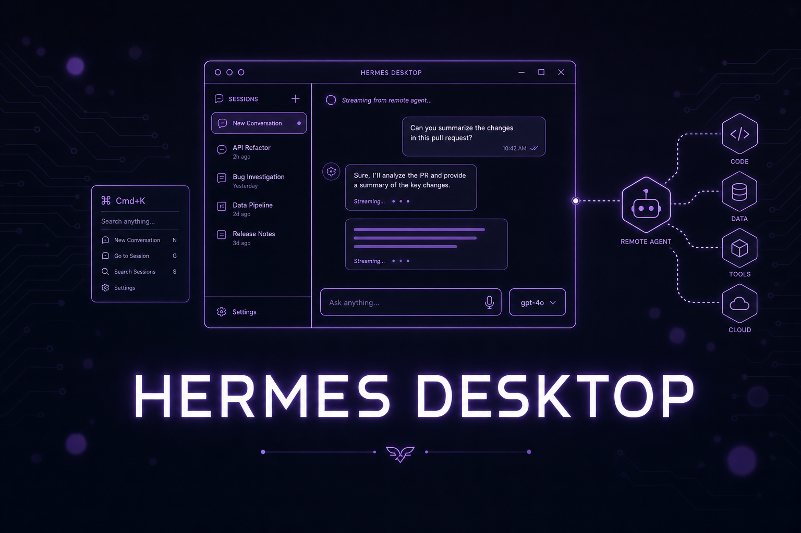

# Part 24: Hermes Desktop App — A Real GUI Over the Same Agent

<p align="center">
  
</p>

*The v0.16.0 "Surface Release" shipped **Hermes Desktop**: a native macOS/Windows/Linux app that runs the exact same agent as the CLI, TUI, and gateway. Same config, same keys, same sessions, same skills, same memory — it's "another surface over one agent, not a fork." If you've avoided Hermes because you didn't want to live in a terminal, this is your on-ramp.*

---

## 1. Install and Launch

If Hermes is already installed, the app is one command away:

```bash
hermes desktop
```

The first run downloads or builds the desktop bundle (e.g. `Hermes.app` on macOS) and launches it. To build the desktop app as part of a fresh install, pass the installer flag:

```bash
# macOS / Linux
curl -fsSL https://hermes-agent.nousresearch.com/install.sh | bash -s -- --include-desktop
```

On **Windows**, the native installer ships a signed bootstrap that can include the desktop app:

```powershell
iex (irm https://hermes-agent.nousresearch.com/install.ps1)
```

Once installed it behaves like any other desktop program — pin it to your dock/taskbar and launch it without the terminal.

> **Same brain, new face.** The desktop app talks to the same agent core as everything else. A session you start in the app shows up in `hermes sessions`, and a skill the agent wrote from Telegram is available in the app. Nothing is siloed.

---

## 2. The Chat Surface

The main window is a streaming chat with **live tool activity** — you watch tool calls run inline instead of staring at a spinner. Highlights:

- **Shared history across surfaces** — desktop, CLI, TUI, and messaging all read/write the same sessions.
- **Drag-and-drop files** — drop a file onto the composer to attach it.
- **Clipboard image paste** — paste a screenshot straight in.
- **Right-hand preview rail** — rendered output (files, images, results) opens beside the chat instead of scrolling away.
- **Composer history and queue editing** — press up/down in the composer to recall previous messages and edit a queued message before it sends.

---

## 3. Command Palette and Keyboard

- **Command palette:** `Cmd+K` (macOS) / `Ctrl+K` (Windows/Linux) opens a fuzzy command palette for nearly everything — switch sessions, change model, open settings, run commands.
- **Rebindable shortcuts:** remap keys to taste.
- **Custom zoom:** scale the whole UI up or down.
- **Language switcher:** the desktop UI is fully internationalized. v0.16 added **Simplified Chinese (简体中文)**; English is the default. Switch via the UI language picker (`display.language`).

---

## 4. The Model Picker

Hermes is model-agnostic, and the desktop makes switching trivial. The **model picker** sits in the composer (left of the mic) and lets you change the **model**, **reasoning effort**, and **fast mode** per message:

- The picker is **sticky per device** and **never writes your profile default** — experiment freely without rewriting config.
- Set your actual default in **Settings → Model**, including per-model reasoning-effort and fast-mode presets.
- It's the same fuzzy, hourly-refreshed catalog you get in the TUI/CLI/web (see [Part 9](./part9-custom-models.md) for routing and aliases).

---

## 5. Status Bar and the YOLO Toggle

The status bar shows live session state and exposes a **per-session YOLO toggle**. Flipping YOLO on bypasses approval prompts for that session so the agent runs tools without stopping to ask.

> **Use YOLO deliberately.** It is genuinely useful for trusted, low-stakes loops on your own machine. Do **not** enable it for any session that reads untrusted input (email, webhooks, public chats) or has destructive tools wired up. Read [Part 19: Security Playbook](./part19-security-playbook.md) first, and keep the approval layer on for anything that touches production.

---

## 6. First-Run Quick Setup via Nous Portal

First launch offers two paths:

- **Quick Setup** — `hermes portal` signs you in through the [Nous Portal](https://portal.nousresearch.com) and picks a model for you. The fastest way from zero to a working agent without touching YAML or hunting for API keys.
- **Full Setup** — the complete onboarding UI: providers and keys, models, tools, MCP servers, gateway, and sessions. xAI Grok OAuth is first-class here.

You can re-open onboarding any time from Settings.

---

## 7. Connect to a Remote Hermes

The desktop app doesn't have to run the agent locally. It can connect to a **remote Hermes gateway** over a secure WebSocket (`/api/ws`):

- **Auth:** OAuth or username/password.
- **Per-profile remote host:** point each profile at a different Hermes box.
- **Concurrent multi-profile sessions:** run several profiles at once, and link across them with cross-profile `@session` references.

The model is "**thin GUI local, heavy agent remote**" — keep a lightweight app on your laptop while the agent, tools, and memory live on a workstation, a DGX Spark, or a VPS. (Pair this with [Part 21: Remote Sandboxes](./part21-remote-sandboxes.md) and [Part 25: NVIDIA & Local Hardware](./part25-nvidia-local.md).)

---

## 8. Sessions, Files, and Voice

- **Sessions:** archive, search, and **search-by-id**; run concurrent multi-profile sessions with cross-profile `@session` links.
- **File browser:** set the initial working directory with `hermes desktop --cwd PATH` or the `HERMES_DESKTOP_CWD` environment variable.
- **Voice:** click the mic to talk; macOS prompts for microphone permission once.

### Management Panes

Beyond chat, the app has dedicated panes for **Skills**, **Cron**, **Profiles**, **Messaging**, and **Agents**, plus a **Command Center** — the same surfaces you'd otherwise drive from the [web admin panel](./part12-web-dashboard.md), now native.

---

## 9. Updating

The app checks for updates in the background and offers **one-click update**; manual updates work too. This mirrors the gateway's **check-before-update** flow (verify before pulling) introduced alongside the System page in the web admin panel — see [Part 12](./part12-web-dashboard.md).

---

## 10. Uninstalling

Remove the app from **Settings → About → Danger zone**, or from the CLI:

```bash
hermes uninstall --gui    # remove the desktop GUI only
hermes uninstall          # remove GUI + agent, keep your data
hermes uninstall --full   # remove everything, including data
```

---

## 11. `hermes desktop` Flags

For development and troubleshooting, `hermes desktop` accepts:

| Flag | What it does |
|------|--------------|
| `--skip-build` | Launch without rebuilding the bundle |
| `--force-build` | Force a rebuild before launch |
| `--build-only` | Build the bundle and exit (no launch) |
| `--source` | Run from source instead of a packaged build |
| `--cwd PATH` | Set the initial working directory |
| `--hermes-root PATH` | Point at a specific Hermes install root |
| `--ignore-existing` | Ignore an already-running instance |
| `--fake-boot` | Boot the UI without starting the agent (UI dev) |

---

## When to Use Desktop vs CLI/TUI

- **Desktop** — you want a real GUI: drag-and-drop, image paste, a preview rail, point-and-click model switching, and one-click updates. Great for non-terminal users and for connecting to a remote agent.
- **TUI** (`hermes --tui`) — you live in the terminal but want live tool cards, `/steer`, queueing, and a sticky composer. See [Part 22](./part22-latest-power-moves.md).
- **CLI** (`hermes`) — scripting, cron, CI, and quick one-shots.

It's the same agent underneath — pick the surface that fits the moment and switch whenever you want.
