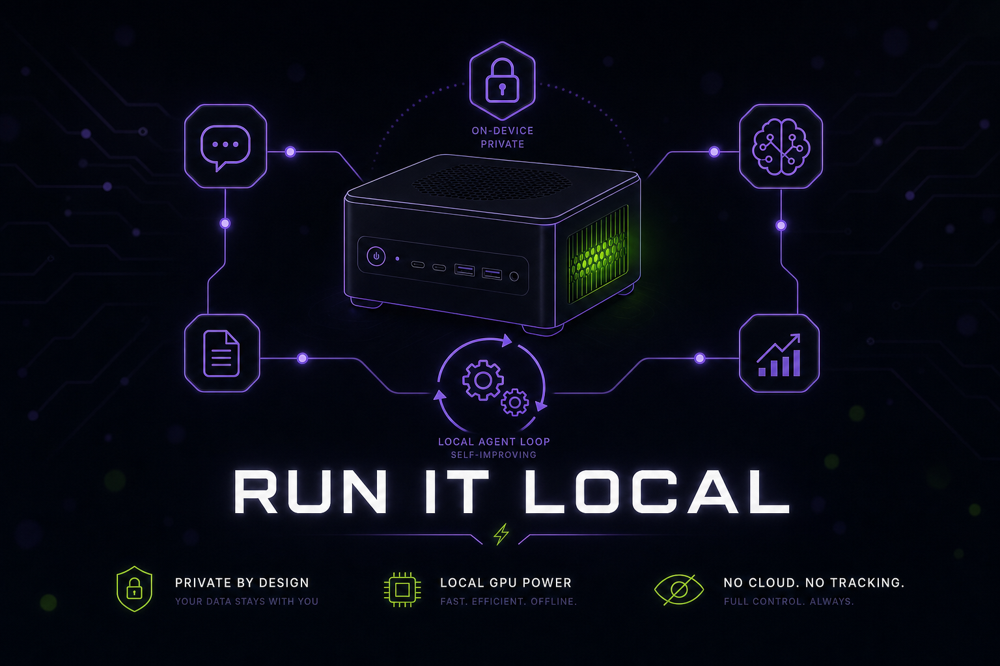

# Part 25: NVIDIA & Local Hardware — Run Hermes on Your Own GPU

<p align="center">
  
</p>

*Hermes is provider- and model-agnostic, and that cuts both ways: you can bring a frontier cloud model **or** run the whole thing on hardware you own. Nous Research and NVIDIA worked together to make Hermes a great **always-on local agent** on **NVIDIA RTX PCs, RTX PRO workstations, and DGX Spark** — your data never leaves the machine, there are no per-token bills, and there are no rate limits. This part is about the harness on local hardware; the specific weights are up to you.*

> Background reading: NVIDIA's writeup, [*Hermes Agent on RTX and DGX Spark*](https://blogs.nvidia.com/blog/rtx-ai-garage-hermes-agent-dgx-spark/).

---

## 1. Why Run Local

- **Privacy** — prompts, files, and memory stay on your hardware. Good for regulated data and for anything you simply don't want to send to a vendor.
- **Cost** — no per-token billing. An always-on agent that watches inboxes, runs cron, and drafts work is far cheaper on owned silicon.
- **No rate limits** — hammer it as hard as your GPU allows.
- **Always-on** — a local box is a natural home for a 24/7 gateway, watchers, and scheduled jobs (see [Part 14](./part14-fast-mode-watchers.md) and [Part 23](./part23-tenacity-stack.md)).

The trade-off is capability per watt: a local model won't match the largest frontier models on the hardest tasks. The fix is **routing**, not religion — keep a cloud model in the fallback chain for the hard 5% and let local handle the rest (see [Part 9](./part9-custom-models.md)).

---

## 2. Hardware Tiers

| Tier | Good for | Notes |
|------|----------|-------|
| **NVIDIA RTX PC** (GeForce RTX) | A capable personal agent, embeddings, drafts, coding lanes | The mainstream entry point; Tensor Cores accelerate inference |
| **RTX PRO workstation** | Heavier, faster local inference | NVIDIA reports up to ~3× faster token generation on RTX PRO GPUs for current open models via `llama.cpp` |
| **DGX Spark** | An always-on local agent that runs big MoE models all day | **128GB unified memory**, ~**1 petaflop** of AI performance; comfortably runs 120B-class MoE models continuously |

All three are first-class targets — pick the one that matches your workload and budget.

---

## 3. The Model-Agnostic Local Stack

Hermes doesn't ship its own inference engine; it points at whatever you're running locally:

- **Ollama** — easiest to start; `ollama pull` a model and select it in `hermes model`.
- **LM Studio** — a first-class Hermes provider with a friendly GUI for managing local models.
- **llama.cpp** — maximum control and the path NVIDIA highlights for RTX PRO throughput.

```bash
# Example: run a local model with Ollama, then point Hermes at it
ollama pull <your-model>
hermes model            # pick the local model in the fuzzy picker
```

Any of these expose an OpenAI-compatible endpoint, so Hermes treats them like any other provider — including in fallback chains. A common, cheap pattern: **local model as primary**, small local model for embeddings, **cloud frontier model as fallback** for the hard cases.

---

## 4. The DGX Spark Playbook

DGX Spark is the flagship local target: 128GB of unified memory means a 120B-class MoE model and its context can sit in memory and stay resident, so the agent is responsive all day instead of paging models in and out.

A strong setup:

1. Run the **gateway** on the DGX Spark so watchers, cron, and messaging stay always-on.
2. Keep a **big local model resident** for the bulk of the work, with a cloud model in the fallback chain for the hardest tasks.
3. Drive it from your laptop with the **[desktop app's remote backend](./part24-desktop-app.md#7-connect-to-a-remote-hermes)** — thin GUI local, heavy agent on the Spark.
4. Put durable work on **[Kanban](./part23-tenacity-stack.md)** so long-running jobs survive restarts.

---

## 5. OpenShell — Kernel-Level Isolation

**OpenShell** is a security runtime from NVIDIA and Microsoft that gives the agent **kernel-level isolation** from the rest of your OS, connecting Hermes to native Windows security primitives. The point: let a capable agent run tools on your machine without handing it the keys to everything.

Treat OpenShell as a complement to — not a replacement for — Hermes' own [approval layer and security playbook](./part19-security-playbook.md). Defense in depth: OS-level isolation underneath, Hermes' denylist/allowlist/quarantine and prompt-injection defenses on top.

---

## 6. NemoClaw and "Build It Yourself"

NVIDIA's **"Build It Yourself"** agentic-AI series teaches building local agents with **NemoClaw** and **OpenShell**. **NemoClaw** is NVIDIA's open-source stack that optimizes **OpenClaw** — the predecessor agent framework many Hermes users migrated from (see [Part 2: OpenClaw Migration](./part2-openclaw-migration.md)) — to run well on NVIDIA devices, now including **WSL2** so Windows users get the optimized path without leaving Windows.

If you're coming from OpenClaw and want a local-first path, NemoClaw + Hermes is the natural pairing.

---

## 7. The NVIDIA Skills Hub Tap

v0.16 added **NVIDIA as a built-in trusted Skills source**, alongside OpenAI, Anthropic, and Hugging Face. That means curated, signed skills for the NVIDIA ecosystem — **CUDA-X**, **AIQ**, and **cuOpt** — are one install away from the [Skills](./part5-creating-skills.md) system, with the same trust model as the other built-in sources.

---

## 8. A Note on Models (Kept Deliberately Light)

Because Hermes is model-agnostic, the "best local model" changes constantly — don't hard-code this week's winner. As a *current* data point, NVIDIA highlights **Qwen 3.6** (27B/35B) running on RTX / DGX Spark and reports it matching or beating prior-generation 120B–400B models while fitting on far smaller hardware. Use that as a starting point, not gospel: open `hermes model`, fuzzy-search, and pick what's good *right now*. The harness is the durable part.

---

## What to Ignore

- **Don't obsess over the leaderboard.** Pick a capable local model, wire a cloud fallback, and move on.
- **Don't run local with no fallback** if you depend on the agent — keep a cloud model in the chain for the hard 5%.
- **Don't skip isolation.** A local agent with shell and file tools is powerful; pair OpenShell (or containers/sandboxes from [Part 21](./part21-remote-sandboxes.md)) with Hermes' approval layer.
- **Don't assume bigger is always better.** A resident mid-size MoE that responds instantly often beats a giant model that pages constantly.
