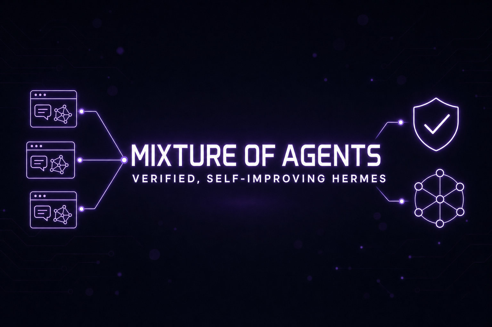

# Part 26: Mixture-of-Agents, Verification & Self-Improvement — The Judgment Stack

<p align="center">
  
</p>

*Hermes v0.18.0 (v2026.7.1, "The Judgment Release") is about how well the agent thinks and how it knows its work is actually done. Three big ideas landed together: **Mixture-of-Agents as a first-class model**, **evidence-based verification** for coding work and `/goal`, and a visible, steerable **self-improvement loop** (`/learn`, `/journey`, and the desktop memory graph). This part shows how to actually use them.*

---

## 1. Mixture-of-Agents — Pick a Council Like You'd Pick a Model

MoA used to be a mode you toggled. As of v0.18 every named MoA preset is a **selectable virtual model** under a `moa` provider — it shows up in the fuzzy model picker on the CLI, TUI, desktop, and gateway right alongside Claude, GPT, and Grok.

```yaml
# ~/.hermes/config.yaml
moa:
  presets:
    my-council:
      references:            # the models that each answer independently
        - anthropic/claude-opus-4.7
        - openai/gpt-5.5
        - xai/grok-4.3
      aggregator: anthropic/claude-opus-4.7   # synthesizes the final answer
```

Then just:

```text
/model my-council      # persistent — route every prompt through the ensemble
/moa <prompt>          # one-shot — run one prompt through the default preset,
                       # then restore your previous model
```

What you get in v0.18:

- **Every reference model's full output renders as its own labelled block** — you read what each model thought *before* the aggregator's synthesis. The committee deliberates in the open.
- **The aggregator's answer streams live** instead of appearing whole after a long silence.
- **References see full tool state** and fire on every user/tool response, so the ensemble works mid-agent-loop, not just on chat one-shots.
- **Opt-in trace persistence** — set `moa.save_traces: true` to dump full-turn traces to JSONL for debugging and evals.

### When to use it (and when not to)

| Use MoA for | Skip MoA for |
|---|---|
| High-stakes decisions (architecture, irreversible ops) | Routine tool-heavy agent loops |
| Hard reasoning where models disagree | Cheap bulk tasks, cron jobs |
| Reviewing another agent's plan or diff | Anything latency-sensitive |
| "Second opinion" one-shots via `/moa` | Long sessions (you pay N models per turn) |

Cost scales with the number of reference models — an ensemble of three frontier models is roughly 4× the tokens of one. Keep a council preset for judgment calls; don't make it your default driver.

> **Gotcha:** the context window resolves from the **aggregator**, and auxiliary tasks route to the aggregator too. Pick an aggregator with a window at least as large as your references' outputs combined.

---

## 2. Verification — "Done" Means Proven, Not Claimed

v0.18 teaches Hermes to judge completion against **evidence** instead of vibes:

- **Coding verification ledger** — `agent.coding_context` detects your project's canonical checks (tests, lint, build) and Hermes records verification evidence when it claims coding work is finished.
- **`pre_verify` hook** — wire in custom checks that must pass before the agent may declare success.
- **verify-on-stop is OFF by default** (a one-time migration tunes defaults) and skips doc-only edits — turn it on for repos where "it compiles and tests pass" is the bar:

```yaml
agent:
  coding_context: true
  verification:
    verify_on_stop: true
    pre_verify: "./scripts/ci-local.sh"
```

### Completion contracts for `/goal`

`/goal` ([Part 23](./part23-tenacity-stack.md#3-use-goal-for-do-not-stop-until-it-is-done)) gained **completion contracts**: state what "done" looks like, and the standing-goal loop judges against that evidence instead of the model's say-so.

```text
/goal Fix the flaky auth test. Done means: pytest tests/auth passes 5 consecutive runs, no skips.
/goal wait <pid>       # park the goal loop on a background process instead of re-poking the agent
```

The difference between "I think I fixed it" and "the tests pass, here's proof." If you run unattended `/goal` sessions or Kanban workers, adopt completion contracts everywhere — it's the single best defense against confident non-completion.

---

## 3. `/learn` and `/journey` — Self-Improvement You Can See

Two commands turn the skill/memory system from a black box into something you steer:

```text
/learn <anything>      # distill a reusable skill from a directory, a URL,
                       # or the workflow you just walked the agent through
/journey               # a timeline of every memory + skill Hermes has
                       # accumulated — edit or delete any of them in place
```

- `/learn` honors your repo's CONTRIBUTING.md skill standards automatically. Teaching Hermes a workflow is now one command, not a manual `skill_manage` authoring session (see [Part 5](./part5-creating-skills.md) for what a good skill looks like — that still matters).
- `/journey` works in the CLI and TUI; the desktop app adds a **memory graph** — a playable radial timeline of memories and skills over time ([Part 24](./part24-desktop-app.md)).
- The post-turn self-improvement fork (the loop that decides whether to save a memory or skill after your turns) now routes to an **auxiliary model**, digests context instead of replaying the whole conversation, and adapts its cadence — it costs a fraction of what it used to. Keep it on.

Monthly hygiene: open `/journey`, prune wrong or stale memories, and check that auto-learned skills match how you actually work. Pair with Curator ([Part 22](./part22-latest-power-moves.md#1-turn-on-curator-before-your-skill-library-becomes-noise)) for the skill side.

---

## 4. Background Fan-Out — Delegate a Fleet and Keep Working

`delegate_task` grew up across v0.17 → v0.18:

```python
# v0.17: one background subagent — returns a handle immediately,
# result re-enters the conversation as a new turn when done
delegate_task(goal="Deep-dive the competitor's pricing page", background=True)

# v0.18: background fan-out — parallel subagents, one consolidated
# turn when ALL of them finish
delegate_task(
    tasks=[
        {"goal": "Audit src/auth for the token-refresh bug"},
        {"goal": "Audit src/billing for the same pattern"},
        {"goal": "Check upstream issues for known reports"},
    ],
    background=True,
)
```

Your chat is never blocked; the CLI/TUI status bar tracks running background subagents. Use fan-out for independent research/audit legs, and keep [Kanban](./part23-tenacity-stack.md) for work that must survive restarts. Full delegation patterns: [Part 8](./part8-subagent-patterns.md).

---

## 5. Small Things You'll Use Every Day

- **`/prompt`** — opens `$EDITOR` to compose a long multi-line prompt in real markdown, queued as your next message. Stop fighting the one-line input box.
- **`/reasoning full`** — uncapped thinking for the current session when you want maximum deliberation.
- **`/timestamps`** + timestamps in `/history` — see when turns actually happened.
- **`/version`** and **`/billing`** — version info and interactive billing from inside the TUI/CLI.
- **In-place compaction** is now the default — compression rewrites the session under a single session id instead of rotating to a new one, so `@session` links and integrations stop breaking on long sessions.
- **Blank Slate setup** — a minimal-agent onboarding mode: start with nothing enabled and opt in tool by tool. The right choice for locked-down or compliance-sensitive boxes.

---

## 6. Running Hermes for a Team — Scale-to-Zero and Managed Scope

If you operate Hermes for more than yourself, v0.17/v0.18 shipped the fleet layer:

- **Scale-to-zero** — the gateway goes dormant when idle and wakes on demand; disruptive lifecycle actions (restart, migration, auto-update) coordinate an **external drain** so nobody is cut off mid-turn.
- **Managed scope** — administrator-pinned, user-immutable config and secrets from root-owned `/etc/hermes`. Pin the security posture; let users own the rest.
- **Multiplexed gateway** (opt-in) — run all profiles over one gateway process.
- **Automation Blueprints** — parameterized automations that render as a form in the dashboard, a slash command in chat, or a conversation — "daily briefing at 8am" without cron syntax.
- **Cron continuations** — scheduled jobs can continue in a thread (with DM-mirror fallback), so a cron report becomes a conversation instead of a dead-end message.

Pair with the hardened dashboard auth ([Part 12](./part12-web-dashboard.md)) and the [Part 19 security playbook](./part19-security-playbook.md) before exposing anything to a network.

---

## Upgrade Checklist (v0.16 → v0.18)

```bash
hermes update --check
hermes backup            # now includes projects.db + kanban boards
hermes update
hermes --version         # expect 0.18.x
```

Then:

1. Define one MoA preset and try `/moa` on a real decision.
2. Turn on verification for your main coding repo and restate your standing `/goal`s as completion contracts.
3. Run `/journey` once — prune anything wrong before it compounds.
4. Try `/learn` on the last workflow you explained to the agent by hand.
5. If you used the **Gemini CLI OAuth** provider, migrate: it was removed in v0.18. Use a Gemini API key, or the new **Vertex AI** provider if your org runs Gemini through GCP ([Part 9](./part9-custom-models.md)).
6. Re-check platform config: Telegram rich messages are on by default; iMessage has a no-Mac path via Photon ([Part 15](./part15-new-platforms.md)).

---

*The theme of mid-2026 Hermes: stop trusting single-model vibes. Ensemble the judgment calls, verify the claims, and audit what your agent thinks it learned.*
